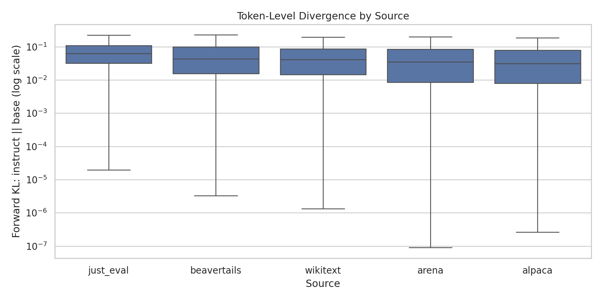
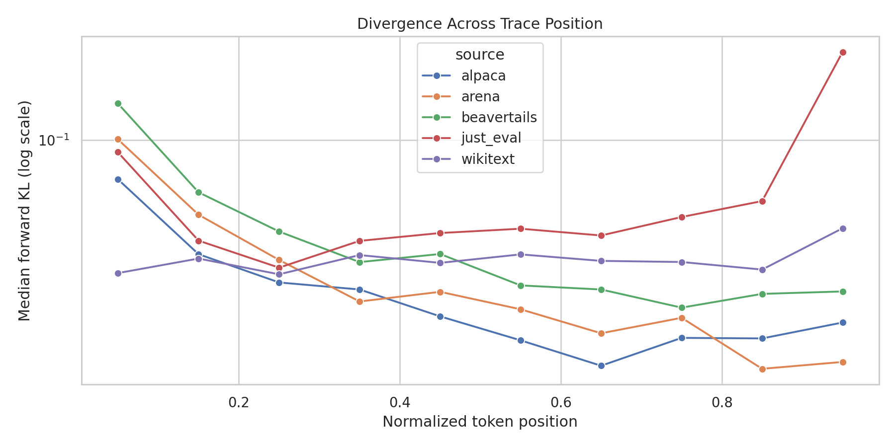
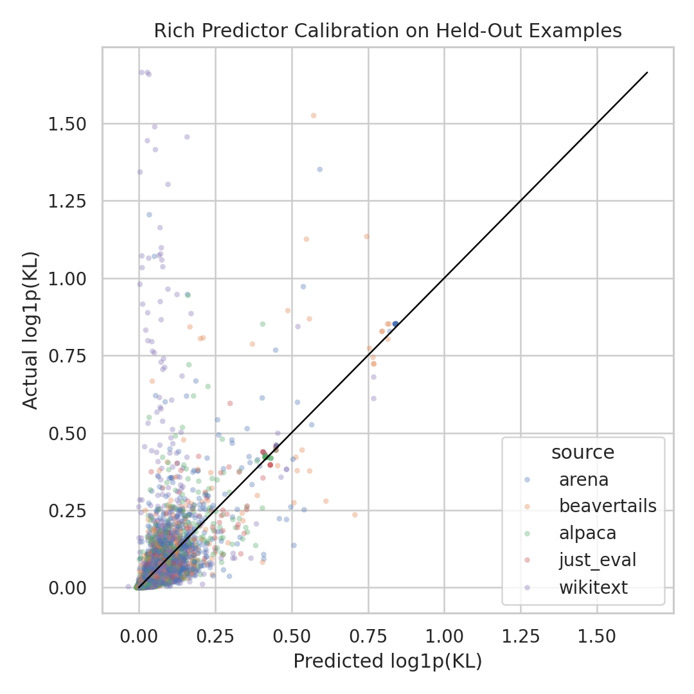
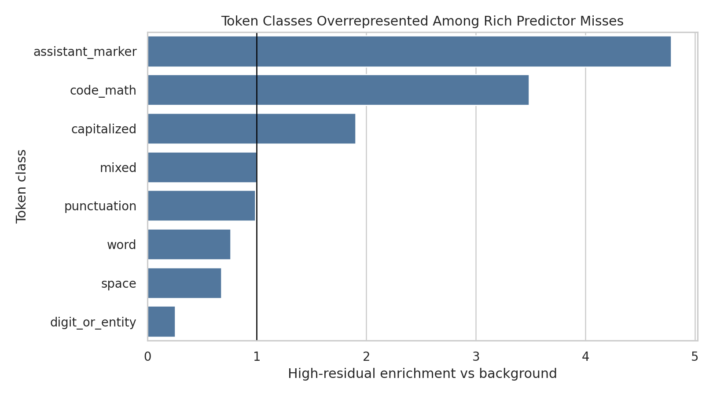

# What's Surprisingly Different Between Base and Instruct Models?

## 1. Executive Summary

We tested whether token-by-token divergence between a base model and its instruction-tuned counterpart can be predicted, and whether the predictor's failures reveal interesting model differences. Using real logits from `Qwen/Qwen2.5-1.5B` and `Qwen/Qwen2.5-1.5B-Instruct`, we computed `KL(p_instruct || p_base)` over 24,049 teacher-forced token positions from Alpaca, JUST-EVAL-INSTRUCT, BeaverTails, Chatbot Arena, and WikiText-2.

The central result supports the hypothesis. A richer KL predictor substantially outperformed a mean baseline and a position/source baseline, but its largest residual misses were informative: high positive misses concentrated in unexpected WikiText narrative spans, while high negative misses often occurred at explicit `Assistant:` boundaries where a simple model expected divergence but both models agreed.

Practically, residual analysis looks useful as an alignment-auditing triage tool. It recovered known shift zones such as generation starts, assistant markers, refusal-style tokens, and code/math, but also surfaced an unexpected natural-text outlier where the instruct model's full distribution diverged sharply from the base model even outside an instruction setting.

## 2. Research Question & Hypothesis

**Research question:** Where do a real base model and its instruction-tuned counterpart differ token by token, and do failures of a learned divergence predictor reveal surprising categories of difference?

**Hypothesis:** If per-token KL divergence is predictable from ordinary features such as source, position, token class, and base-model uncertainty, then places where the predictor is wrong should be enriched for interesting base-vs-instruct differences rather than random noise.

This matters because prior work shows that instruction tuning often shifts response openings, discourse markers, safety/refusal phrases, and formatting tokens. The gap tested here is residual discovery: after learning those obvious regularities, what remains surprising?

## 3. Literature Review Summary

The gathered review identified several directly relevant threads:

| Area | Relevant resource | Takeaway for this experiment |
|---|---|---|
| Base vs aligned token shifts | Lin et al., "The Unlocking Spell on Base LLMs" | Alignment often preserves top choices at many positions but shifts style and safety tokens. |
| Instruction tuning limitations | Ghosh et al., "A Closer Look at the Limitations of Instruction Tuning" | Shifted tokens can be style, response-initiation artifacts, or instruction-data borrowing. |
| Prompt alignment controls | Zhao et al., "Is In-Context Learning Sufficient for Instruction Following?" | Prompt-only alignment can mimic some tuned behavior, motivating future URIAL controls. |
| Safety alignment depth | Qi et al., "Safety Alignment Should Be Made More Than Just a Few Tokens Deep" | Per-token KL can reveal shallow early-token refusal behavior. |
| Token-level objectives | Token-level DPO | Per-token KL is a meaningful unit of analysis for preference/alignment methods. |
| Mechanistic follow-up | Refusal-direction and crosscoder work | Logit residuals should be treated as discovery targets, not final mechanistic proof. |

## 4. Methodology

### Models

- Base: `Qwen/Qwen2.5-1.5B`
- Instruct: `Qwen/Qwen2.5-1.5B-Instruct`
- Tokenizer: Qwen instruct tokenizer, shared vocabulary size 151,936
- Precision: bfloat16 model forward pass, float32 divergence computation
- Device: `cuda:0`

This pair was selected because it is a real open-weight same-family base/instruct pair with a shared tokenizer, avoiding tokenizer-family confounds.

### Datasets

Local pre-gathered datasets were used:

| Source | Examples | Token rows | Role |
|---|---:|---:|---|
| Alpaca 52k | 60 | 5,119 | Instruction-output SFT traces |
| JUST-EVAL-INSTRUCT | 60 | 1,422 | Prompt-only instruction boundary traces |
| BeaverTails 30k | 60 | 4,972 | Safety/refusal-related traces |
| Chatbot Arena mirror | 60 | 7,329 | Real chat prompt-response traces |
| WikiText-2 Raw | 59 | 5,207 | Natural-text baseline |

The final run used 299 encoded examples and 24,049 token positions. Traces were capped at 224 tokens.

### Token-Level Scoring

For each context position, both models were evaluated on the identical teacher-forced prefix. The primary target was:

```text
KL(p_instruct(. | context) || p_base(. | context))
```

We also saved reverse KL, Jensen-Shannon divergence, base entropy, base top probability, base margin, observed-token base logprob/rank, top-1 agreement, decoded base top-1 token, and decoded instruct top-1 token.

### Predictors

The regression target was `log1p(forward_KL)`.

| Predictor | Features |
|---|---|
| Mean baseline | Training mean only |
| Position/source baseline | Source, segment, context position, normalized position, response-token index, generation-start flag |
| Rich predictor | Position/source features plus token class, frequent token identity, safety label, base entropy, base top probability, base margin, observed-token logprob/rank, token surface flags |

Models used scikit-learn `HistGradientBoostingRegressor`, with train/test split grouped by example id to prevent token rows from the same trace appearing in both train and test.

### Statistical Analysis

- Example-grouped held-out evaluation: 224 train examples, 75 test examples.
- Bootstrap confidence intervals: 500 grouped bootstrap resamples over held-out examples.
- Source comparisons: Mann-Whitney U tests on per-example mean KL with Holm correction.
- Effect size: Cliff's delta for source comparisons.

## 5. Results

### Source-Level Divergence

| Source | Mean KL | Median KL | P90 KL | P99 KL | Top-1 Disagree Rate |
|---|---:|---:|---:|---:|---:|
| JUST-EVAL | 0.109 | 0.063 | 0.271 | 0.585 | 0.187 |
| BeaverTails | 0.104 | 0.043 | 0.208 | 1.237 | 0.150 |
| WikiText | 0.096 | 0.042 | 0.184 | 1.145 | 0.131 |
| Arena | 0.084 | 0.035 | 0.176 | 1.260 | 0.131 |
| Alpaca | 0.071 | 0.031 | 0.172 | 0.559 | 0.128 |

Prompt and boundary positions were consistently more divergent than ordinary response continuations. Generation-start mean KL was especially high in BeaverTails:

| Source | Generation-start mean KL | Median KL | P90 KL |
|---|---:|---:|---:|
| BeaverTails | 0.802 | 0.504 | 2.085 |
| Arena | 0.444 | 0.414 | 0.846 |
| Alpaca | 0.355 | 0.296 | 0.627 |
| JUST-EVAL | 0.352 | 0.272 | 0.688 |
| WikiText | 0.159 | 0.095 | 0.262 |

Figures:





### Predictor Performance

| Model | MAE | RMSE | R2 | Spearman r |
|---|---:|---:|---:|---:|
| Mean baseline | 0.0756 | 0.1471 | -0.0007 | n/a |
| Position/source baseline | 0.0601 | 0.1256 | 0.2710 | 0.414 |
| Rich predictor | 0.0460 | 0.1183 | 0.3533 | 0.795 |

The rich predictor improved held-out MAE by 0.0142 versus the position/source baseline. The grouped bootstrap 95% CI for `rich - position_source` MAE was `[-0.0163, -0.0118]`, so the improvement was stable across held-out-example resampling.



### Source-Level Statistical Tests

After Holm correction on per-example mean KL, the strongest source differences were:

| Comparison | Mean A | Mean B | Holm p | Cliff's delta |
|---|---:|---:|---:|---:|
| Alpaca vs JUST-EVAL | 0.0898 | 0.1131 | 0.000087 | -0.471 |
| Alpaca vs BeaverTails | 0.0898 | 0.1230 | 0.00710 | -0.356 |

Most other source comparisons were not significant after correction, including Arena vs WikiText and BeaverTails vs WikiText at the example-mean level.

## 6. Residual Analysis: Where the Predictor Was Wrong

The residual target was:

```text
actual log1p(KL) - predicted log1p(KL)
```

The rich predictor's median absolute residual was 0.0202. The 98th percentile absolute residual threshold was 0.2961.

### Enrichment Among High-Residual Tokens

| Feature | Value | High-residual enrichment |
|---|---|---:|
| Segment | generation_start | 5.17x |
| Token class | assistant_marker | 4.78x |
| Token class | refusal_style | 4.54x |
| Token class | code_math | 3.49x |
| Source | WikiText | 3.13x |
| Token class | capitalized | 1.90x |



### Positive Residuals: Actual KL Much Higher Than Predicted

The largest positive residuals were unexpectedly dominated by a WikiText narrative example. In the top 150 absolute residuals, 84 were WikiText rows, and 61 came from one WikiText example (`wikitext:4314`). This is not just "instruction boilerplate"; it is a natural-language passage where the instruct model and base model sharply diverged in the full next-token distribution.

Representative high positive misses:

| Source | Token | KL | Predicted log1p(KL) | Residual | Base top-1 | Instruct top-1 | Interpretation |
|---|---:|---:|---:|---:|---|---|---|
| WikiText | `is` | 4.282 | 0.0097 | 1.655 | `"` | `"` | Top-1 agrees, but full distributions diverge strongly. |
| WikiText | `other` | 4.283 | 0.0281 | 1.636 | `two` | `pool` | Natural narrative continuation shifts are not captured by style/position features. |
| WikiText | `cares` | 4.249 | 0.0334 | 1.625 | `calls` | `approaches` | Instruct model appears to favor different narrative continuation modes. |
| Arena | `They` | 2.336 | 0.0345 | 1.170 | `<|endoftext|>` | `They` | Instruct model remains in assistant-continuation mode where base is ready to stop. |

The top-1 agreement case is especially important: full-distribution KL can be large even when the argmax token is unchanged. Residual analysis therefore catches differences that top-token agreement plots would miss.

### Negative Residuals: Predictor Expected More KL Than Actually Occurred

Large negative residuals often appeared around explicit `Assistant:` markers. The predictor learned that assistant markers and generation starts are often high-divergence zones, but in many held-out contexts both models simply predicted the marker or response opening similarly.

Representative negative misses:

| Source | Token | KL | Predicted log1p(KL) | Residual | Base top-1 | Instruct top-1 | Interpretation |
|---|---:|---:|---:|---:|---|---|---|
| Arena prompt | `Assistant` | 0.146 | 0.508 | -0.372 | `Assistant` | `Assistant` | Explicit chat markup makes the base model agree with the instruct model. |
| BeaverTails prompt | `Assistant` | 0.085 | 0.405 | -0.323 | `Assistant` | `Assistant` | A known high-divergence category can collapse when the boundary is literal. |
| Arena response | `Transform` | 0.037 | 0.297 | -0.260 | `Transformers` | `Transformers` | Response start looked risky to the predictor, but both models agreed. |

This is useful: it suggests that "assistant marker" is not a uniformly high-divergence feature. The surrounding context and whether the marker is already explicit matter.

## 7. Interpretation

The experiment supports the submitter's idea. A learned predictor can explain a meaningful amount of token-level KL, but its misses are scientifically useful rather than arbitrary.

Three findings stand out:

1. **Boundary effects are real but predictable.** Generation starts and prompt/response boundaries have high KL, especially in BeaverTails, matching shallow-alignment and instruction-tuning literature.
2. **Residuals reveal non-obvious natural-text divergence.** The strongest positive errors were not refusal phrases or assistant style tokens; they were WikiText narrative continuations. This suggests instruction tuning may alter narrative continuation distributions more than expected from surface features.
3. **Top-1 agreement is insufficient.** Some high-KL residuals had the same base and instruct top-1 token, meaning the difference lives in probability mass beyond the argmax.

The most surprising result is the WikiText outlier. It may represent a genuine instruct-vs-base shift in continuation priors, a tokenizer/context artifact, or an outlier passage where the base model is very confident in a different latent continuation mode. Either way, it is exactly the kind of target residual analysis is meant to surface for follow-up.

## 8. Limitations

- Only one model pair was tested, and it is a 1.5B model. Results may differ for larger Qwen, Gemma, Llama, or Mistral pairs.
- The sample size was intentionally medium-scale: 60 examples per source and max 224 tokens. This is enough to test the workflow, not enough for a definitive taxonomy.
- The predictor uses observed-token surface features and base-model statistics. That is appropriate for teacher-forced residual discovery, but it is not a deployment setting where future sampled tokens are unknown.
- No URIAL/base-plus-prompt control was run. That would help separate prompt-induced style from weight-level post-training changes.
- Residual categories are heuristic. They are discovery aids, not final labels.
- The top positive residuals were dominated by one WikiText example. This is a finding, but it also warns that outlier examples can dominate qualitative conclusions.
- Safety examples were sanitized in residual tables to avoid reproducing harmful instructions, so qualitative analysis of unsafe contexts is intentionally less detailed.

## 9. Reproducibility and Validation

Environment:

- Python: 3.12.8
- PyTorch: 2.12.0+cu130
- Transformers: 5.10.2
- scikit-learn: 1.9.0
- CUDA: 13.0
- GPUs detected: 4 x NVIDIA RTX A6000, 48,541 MiB each
- GPU used: `cuda:0`
- Batch size: 8, chosen conservatively because full-vocabulary KL requires large logit tensors for two models.
- Runtime: 66.4 seconds for the final run after model cache availability.

The full experiment was run twice with the same seed and config. The row count, source stats, predictor metrics, bootstrap summaries, and residual summaries matched exactly across runs. The first summary is retained at `results/summary_first_run.json`; the final summary is at `results/summary.json`.

Reproduction command:

```bash
source .venv/bin/activate
python src/run_divergence_experiment.py \
  --examples-per-source 60 \
  --max-length 224 \
  --batch-size 8 \
  --bootstrap-iterations 500
```

Primary outputs:

- `results/token_kl_metrics.csv.gz`: token-level KL and auxiliary metrics
- `results/heldout_predictions.csv`: held-out predictor predictions and residuals
- `results/top_abs_residuals.csv`: largest rich-predictor misses
- `results/residual_enrichment.csv`: high-residual enrichment table
- `results/source_stats.csv`: source-level KL summaries
- `results/source_pair_tests.csv`: Mann-Whitney tests with Holm correction
- `figures/*.png`: visual summaries

## 10. Conclusions & Next Steps

The answer to the research question is yes, with caveats. Token-level KL between a base and instruct model is partly predictable, and the places where the predictor fails are informative. The method recovered known divergence zones and surfaced a surprising natural-text residual cluster that would merit closer follow-up.

Recommended next steps:

1. Repeat on larger same-family pairs such as Qwen 7B, Gemma base vs IT, and Llama base vs instruct/chat.
2. Add a base+URIAL prompt control to distinguish prompt-format effects from weight-level instruction tuning.
3. Expand WikiText and natural-text sampling to test whether the narrative outlier is common or isolated.
4. Inspect high positive residuals with top-k probability tables, not only top-1 tokens.
5. Use activation-level tools such as TransformerLens or crosscoders on the strongest residual spans after confirming they replicate.

## References and Resources

- `literature_review.md`
- `resources.md`
- `papers/2312.01552_the_unlocking_spell_on_base_llms_rethinking_alignment_via_in_context_learn.pdf`
- `papers/2402.05119_a_closer_look_at_the_limitations_of_instruction_tuning.pdf`
- `papers/2405.19874_is_in_context_learning_sufficient_for_instruction_following_in_llms.pdf`
- `papers/2406.05946_safety_alignment_should_be_made_more_than_just_a_few_tokens_deep.pdf`
- `papers/2404.11999_token_level_direct_preference_optimization.pdf`
- `papers/2406.11717_refusal_in_language_models_is_mediated_by_a_single_direction.pdf`
- Hugging Face datasets documented in `datasets/README.md`
- Qwen model checkpoints: `Qwen/Qwen2.5-1.5B`, `Qwen/Qwen2.5-1.5B-Instruct`
